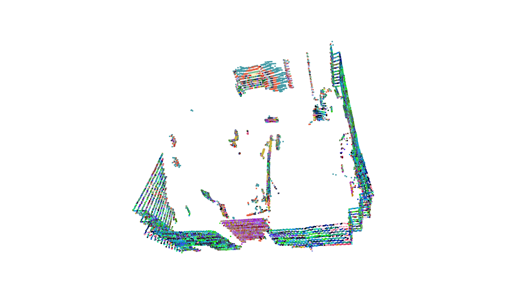
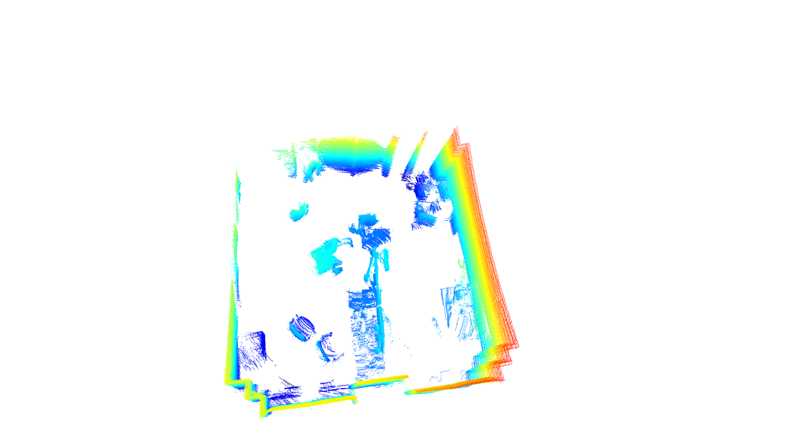
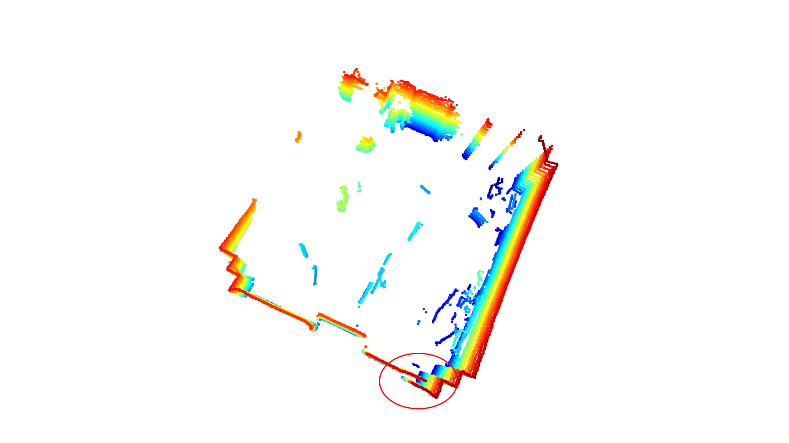
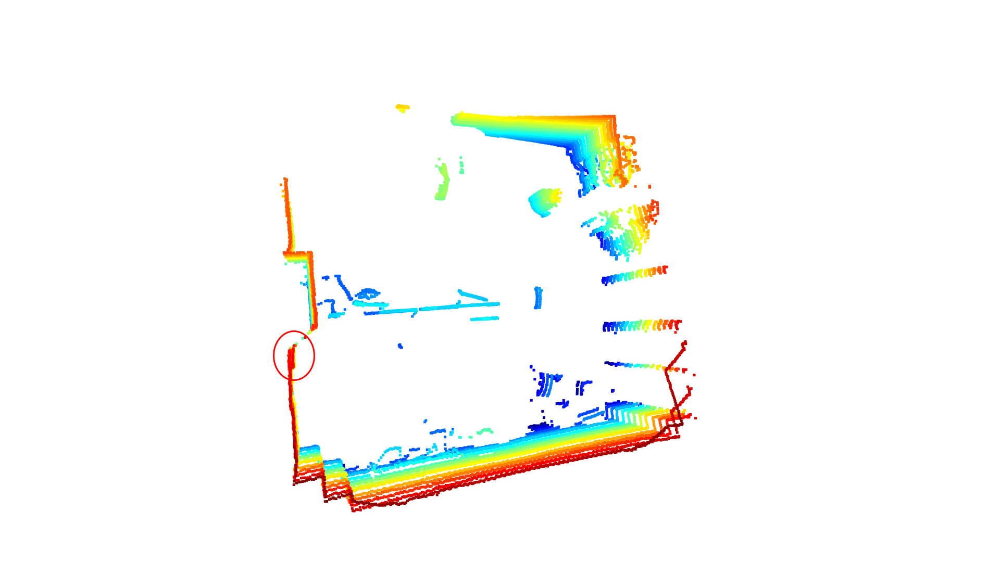
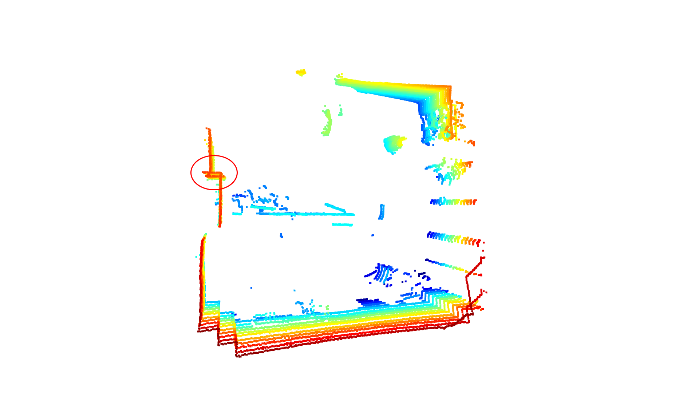
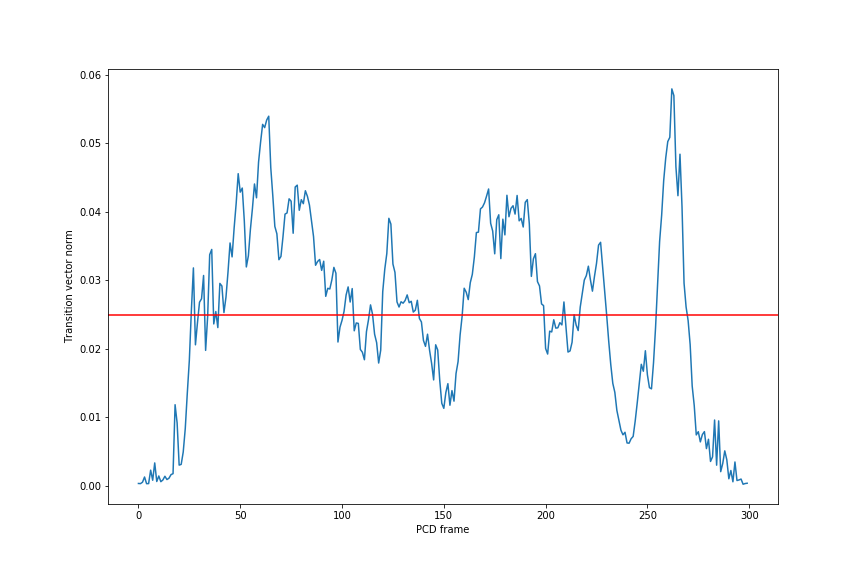
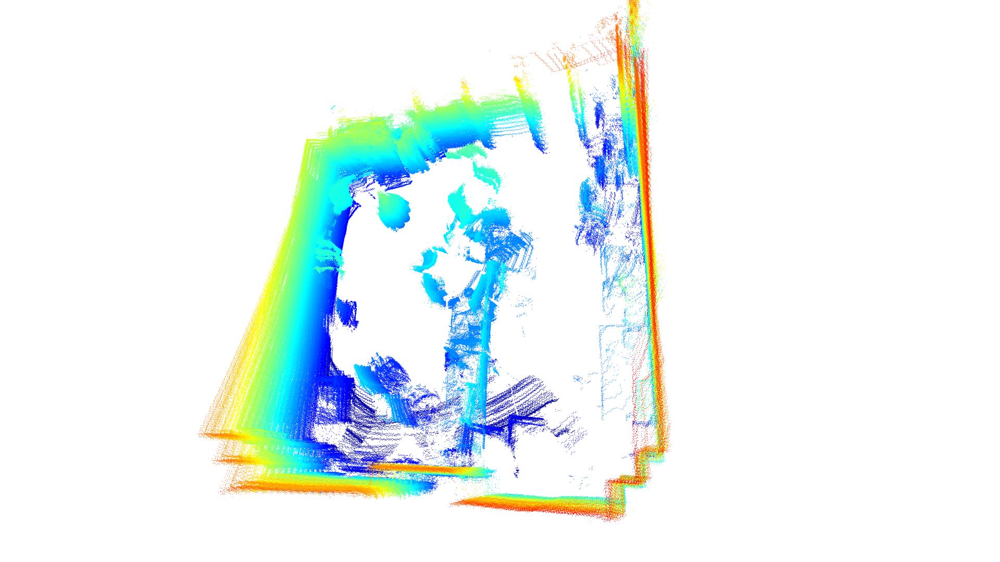
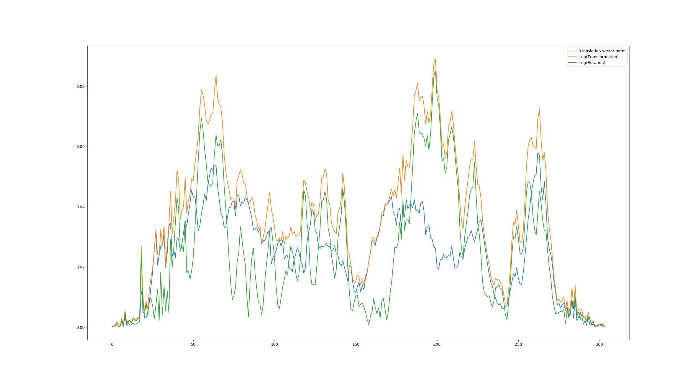
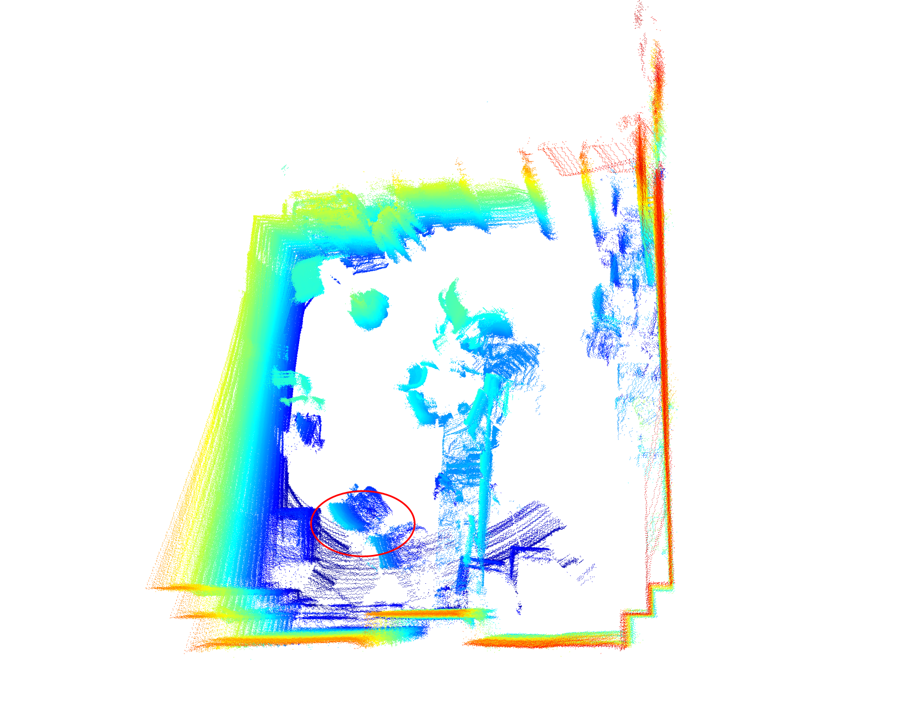

# Description

This repo is devoted for building 3D scene from sequence of PCDs (Point Clouds)
from Velodyne [VLP-16 Puck LITE](https://velodynelidar.com/products/puck-lite/).

Files are recorded using `rosbag` (TODO: maybe other effective approaches can be in use), then recorded bag-files are transformed to pcd-files (details are in section "From .bag to .pcd").

Obtained Velodyne PCD is declared by the next header:

```
# .PCD v0.7 - Point Cloud Data file format
VERSION 0.7
FIELDS x y z intensity ring time
SIZE 4 4 4 4 2 4
TYPE F F F F U F
COUNT 1 1 1 1 1 1
WIDTH 9462
HEIGHT 1
VIEWPOINT 0 0 0 1 0 0 0
POINTS 9462
DATA ascii
```

That means, that every point also has information about intensity from 0 to 255
, ring (level of sensor in LIDAR) -- from 0 to 15, and timestamp.

Information about intensity can be used as colors for Colored ICP
(it is not easy to use directly Open3D IO-tools, details are in section "Problems).
Ring information can be used to remove first and last rows from point cloud, because
they may be noised and produced by undesirable reflections.
Timestamps can be used to eliminate "Rolling-shutter" effect in LIDARs.

## From .bag to .pcd

To obtain .pcd files from .bag use:

`rosrun pcl_ros bag_to_pcd <bag-file.bag> /velodyne/pointcloud2 <directory for pcds>`

The command above obtains PCD-files in binary format. To get ASCII format (can be used in understanding of Velodyne format) use:

`pcl_convert_pcd_ascii_binary <existing binary.pcd> <new ASCII.pcd> 0`

To convert all folder of PCDs to new folder use:

`for f in *.pcd ; do pcl_convert_pcd_ascii_binary $f ../new_pcds/$f 0 ; done`

## Requirements

* Open3d 0.9.0 (Version is IMPORTANT! Because library is raw enough and very different between versions.)
* Others from `requirements.txt`

## Problems

#### Conversion to colored format
Besides point clouds, VLP-16 Puck LITE produces also intensity of each point. 
This information can be used in different approaches in ICP with Colored points (the basic one is presented in [examples](http://www.open3d.org/docs/release/tutorial/Advanced/colored_pointcloud_registration.html) of Open3D). 
Attention: in PCD-file color fields should be normalized to be correctly processed by Open3D IO-tools. 

In this repo conversion tool is implemented in `color_extractor.py`.
It removes `ring` and `timestamp` fields, as well as normalizes `intensity` field to [0, 1].

On the image below intensity as color PCD is shown.
It seems that there are some patterns on walls, that can be used in advanced ICP.



#### Good segments from dataset and bad artifacts

There is a set of images in dataset with some effects,
that produces bad results in alignment. Main hypothesis of such effects
is movement of the sensor similar to the "rolling-shutter" effect in CMOS cameras.

Dataset contains 305 PCDs. From 0 to 50 they are looked good enough. ICP produces the
next result on those frames.




Images from 51 till 95 seems to be distorted. Distortions are produced by
sharp movement (or maybe I've mistaken). Below some examples with marked distortions
-- undesirable gaps and intersections -- are demonstrated. They should be dropped from
frames for alignment, because they produce incorrect planes.





For other frames it is difficult to find out artifacts like in previous segments.
Alignment results show that they exist, but it is difficult to find them visually.

#### Automatization of dropping frames with artifacts

It seems, that artifacts arise when transition of sensor is too much between frames.
As the next step transition vector from transformation between frames was extracted and
its norm was estimated. Below plot with transition norms is attached.



Frames with transition vector norm higher than some border (red line on the plot) are dropped during algorithm.
The remained amount of frames is approximately 1/3 of all 305 frames.
Alignment algorithm gives the next result on them. It seems to me, that it is good and doesn't "flow".



Also, it was suggested to use more robust sophisticated metrics to analyze artifacts presence -- metrics for transformation and rotation from `mrob`.
On the plot below results of metrics function are demonstrated.



Playing with different borders for those metrics gives improvements only for transformation metric.
It is shown on the attached image -- chair has more holistic structure.



#### To be described:
* Last raw of scanner
* Approaches with colored ICP
